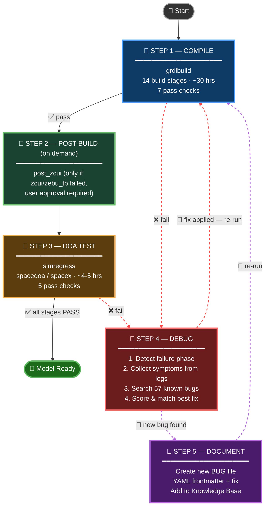
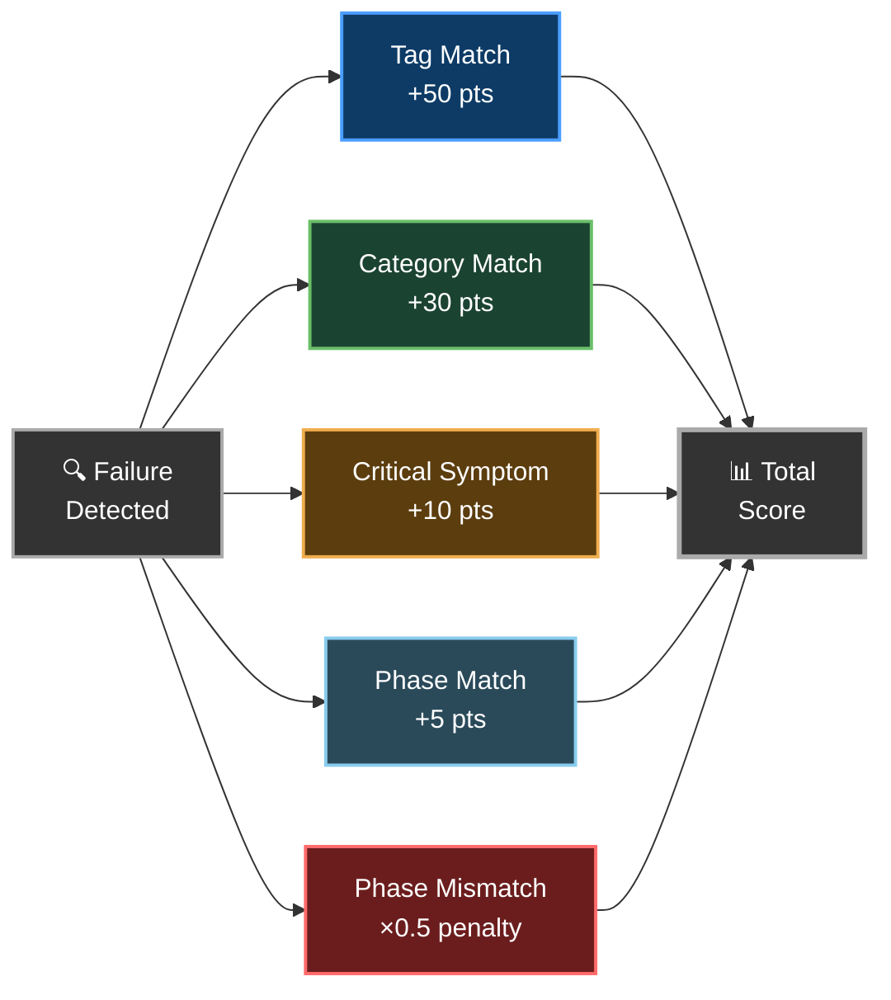

<div align="center">

# 🤖  Emulation Agent

**An AI-powered agent that compiles, tests, debugs, and fixes ZeBu ZSE5 emulation models — end to end.**

[](https://github.com/tbaziza/emulation_agent)
[](05_knowledge_and_debugging/known_bugs_and_fixes/)
[]()

</div>

---

## 📦 First-Time Setup

> **One-time install — do this once per environment.**

### Step 1: Clone the Knowledge Base

```bash
git clone https://github.com/tbaziza/emulation_agent.git
```

### Step 2: Run the init script

```bash
bash emulation_agent/copilot_cli_agent/init_agent.sh
```

The script will:
1. **Ask for your working disk path** — enter the path to your large project disk (e.g. `/nfs/site/disks/ive_sle_zsc11_<userid>`). This is NOT the model workarea, just your general working disk.
2. **Move your Copilot agents** to the working disk (avoids NFS home quota issues) and create a symlink back at `~/.copilot/agents`
3. **Install the `sle_emulation_agent`** into the agents directory with `KB_ROOT` pre-configured
4. **Install skills** — copies skill files from the KB into the agents directory (rtlchanges, analysis opts, etc.)

### Step 3: Done — load the agent

Once the script prints **✅ Setup Complete!**, the agent is ready. Launch Copilot CLI and select it:

```bash
/p/hdk/cad/copilot/latest/copilot
/agent sle_emulation_agent
```

> 💡 **To update later**, `git pull` inside `emulation_agent/` and re-run `init_agent.sh` with the same working disk path.

---

## ⚡ Quick Start (Daily Use)

```bash
# 1. Go to your model workarea
cd <your_model_workarea>

# 2. Set up the model (IMPORTANT — must be done before anything else)
cth_psetup <your_stepping>

# 3. Launch Copilot CLI
/p/hdk/cad/copilot/latest/copilot

# 4. Select the agent
/agent sle_emulation_agent

# 5. Start working
You: compile the model
```

> ⚠️ **You must set up the model with `cth_psetup` before launching Copilot CLI.** The agent relies on the environment that `cth_psetup` configures.

That's it. You're ready to go.

---

## 🎯 What Can I Ask?

### 🔨 Compilation
| Prompt | What it does |
|--------|-------------|
| `compile the model` | Start a fresh grdlbuild |
| `resume the build` | Continue a build with `-id` |
| `check if compilation passed` | Run the 6 pass checks |

### 🔧 Post-Build
| Prompt | What it does |
|--------|-------------|
| `run post-build (recovery)` | Run post_zcui — only when zcui/zebu_tb failed, with user approval |

### 🧪 Testing
| Prompt | What it does |
|--------|-------------|
| `run DOA tests` | Submit spacedoa/spacex via simregress |
| `check if the test passed` | Run the 5 pass checks |
| `check test status in <path>` | Verify a specific test workarea |

### 🐛 Debugging
| Prompt | What it does |
|--------|-------------|
| `debug this failure` | Full triage: phase detection → symptoms → bug matching |
| `debug the build failure` | Analyze grdlbuild errors |
| `debug the test in <path>` | Analyze a specific DOA test failure |
| `search known bugs for <error text>` | Search the 57 BUG files |
| `what known bugs match <symptom>?` | Find matching bugs by keyword |

### 📋 Status & Info
| Prompt | What it does |
|--------|-------------|
| `what build stage are we on?` | Check .shadow progress |
| `show the build stages` | List all 14 stages |
| `what DOA tests are available?` | List test options |
| `show safety rules` | Review the red lines |

### 🔄 Full Workflow
| Prompt | What it does |
|--------|-------------|
| `compile, test, and debug until it passes` | End-to-end loop |

### 🧩 Skills (auto-installed)
| Skill | What it does |
|-------|-------------|
| `sle-build-rtlchanges-create` | Create new rtlchange files (replacement + .ref + HSDs.toml + PKG_IP_CHANGES.cfg) |
| `sle-build-rtlchanges-refresh` | Fix stale .ref files and HSDs.toml after IP drops |
| `sle-build-new-target-analysis-opts` | Debug missing global analysis/elab opts for new build targets |

---

## 🔄 How It Works



---

## 🛡️ Safety Guarantees

| Rule | Detail |
|------|--------|
| 🚫 No showstopper queue | Always uses `/prj/sv/nvl/emu/interactive` |
| 🚫 No `-local` flag | Prevents silent failures (BUG-001) |
| 🚫 No mid-run resubmits | Waits for full PASS/FAIL before acting |
| ✅ Full logbook checks | emurun PASS ≠ overall PASS |
| ✅ Always asks first | Never auto-commits to git |

---

## 🎯 Bug Match Confidence Score

When a failure occurs, the agent searches **57 known bugs** and scores each match. The top-3 ranked results are presented so you can decide.

### How Scoring Works



### Scoring Weights

| Signal | Points |
|--------|--------|
| Exact tag match (e.g., `rpath`, `dlopen`) | **+50 pts** |
| Category match (e.g., `library`, `runtime`) | **+30 pts** |
| Phase match (e.g., `EMU_SETUP`) | **+5 pts** |
| Phase mismatch | **×0.5 penalty** (halves score) |
| Critical symptom found | **+10 pts** |

### Confidence Levels

| Score | Level | What it means |
|-------|-------|---------------|
| ≥ 200 | 🟢 **VERY HIGH** | Almost certainly this bug — apply fix directly |
| 50 – 99 | 🟡 **HIGH** | Strong match — apply fix, but verify |
| 15 – 29 | 🟠 **MEDIUM** | Possible match — review the BUG file before acting |
| < 15 | 🔴 **LOW** | Weak match — likely a new or unknown issue |

### Example

> A test fails with a `dlopen` error during **EMU_SETUP** phase:
>
> | Signal | BUG-026 | Points |
> |--------|---------|--------|
> | Tag `dlopen` matches | ✅ | +50 |
> | Category `library` matches | ✅ | +30 |
> | Phase `EMU_SETUP` matches | ✅ | +5 |
> | **Total** | | **85 → 🟡 HIGH** |
>
> → Agent applies BUG-026 fix and re-runs.

---

## 📂 Knowledge Base

```
📁 emulation_agent/
├── 📄 00_index.md                          ← Start here
├── 📁 01_agent_core/                       ← Identity, safety rules, AI guidelines
├── 📁 02_execution/                        ← Build commands, environment setup
├── 📁 03_testing_and_validation/           ← DOA tests, emulator setup, quality gates
├── 📁 04_monitoring/                       ← Metrics, alert thresholds
├── 📁 05_knowledge_and_debugging/          ← Debug workflow, symptom rules
│   ├── 📁 known_bugs_and_fixes/            ← 57 bug files (BUG-001 to BUG-057)
│   ├── 🔧 run_phase_detection_nvlax.sh     ← Automated bug matcher
│   └── 📄 symptom_rules.txt                ← Keyword expansion rules
├── 📁 06_skills/                           ← Copilot CLI skills (auto-installed)
│   ├── 📄 sle-build-rtlchanges-create.md   ← Create new rtlchange files
│   ├── 📄 sle-build-rtlchanges-refresh.md  ← Fix stale .ref / HSDs.toml
│   └── 📄 sle-build-new-target-analysis-opts.md ← Fix missing analysis/elab opts
└── 📁 copilot_cli_agent/                   ← Agent + init script
```

---

## 🔍 Verify Setup

Inside Copilot CLI, run these commands:

```
/agent              → should show sle_emulation_agent
/instructions       → should show 4 loaded files
/env                → should show instruction paths
```

---

<div align="center">

**Created by Tomer Baziza** · SLE Emulation · Intel

</div>
