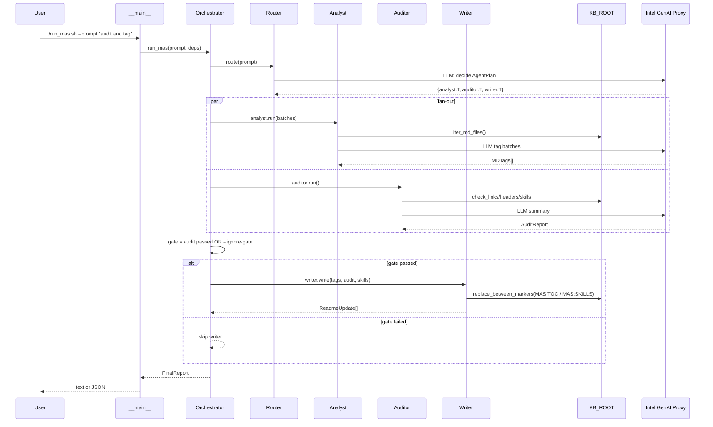
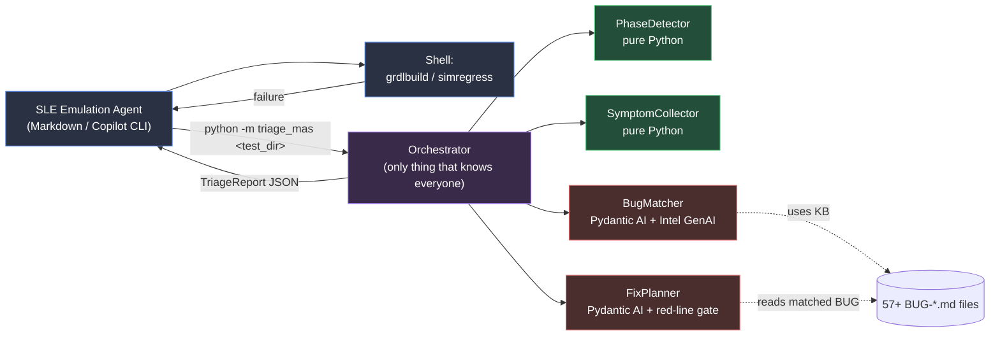
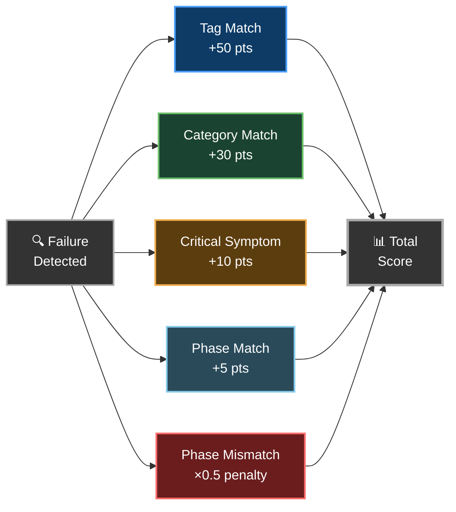

<div align="center">

# 🤖  Emulation Agent

**An AI-powered agent that compiles, tests, debugs, and fixes ZeBu ZSE5 emulation models — end to end.**

[](https://github.com/tbaziza/emulation_agent)
[](05_knowledge_and_debugging/known_bugs_and_fixes/)
[]()

</div>

---

## 📦 First-Time Setup

> **One-time install — do this once per environment.**

### Step 1: Clone the Knowledge Base

```bash
git clone https://github.com/tbaziza/emulation_agent.git
```

### Step 2: Run the init script

```bash
bash emulation_agent/copilot_cli_agent/init_agent.sh
```

The script will:
1. **Ask for your working disk path** — enter the path to your large project disk (e.g. `/nfs/site/disks/ive_sle_zsc11_<userid>`). This is NOT the model workarea, just your general working disk.
2. **Move your Copilot agents** to the working disk (avoids NFS home quota issues) and create a symlink back at `~/.copilot/agents`
3. **Install the `sle_emulation_agent`** into the agents directory with `KB_ROOT` pre-configured
4. **Install skills** — copies skill files from the KB into the agents directory (rtlchanges, analysis opts, etc.)

### Step 3: Done — load the agent

Once the script prints **✅ Setup Complete!**, the agent is ready. Launch Copilot CLI and select it:

```bash
/p/hdk/cad/copilot/latest/copilot
/agent sle_emulation_agent
```

> 💡 **To update later**, `git pull` inside `emulation_agent/` and re-run `init_agent.sh` with the same working disk path.

---

## ⚡ Quick Start (Daily Use)

```bash
# 1. Go to your model workarea
cd <your_model_workarea>

# 2. Set up the model (IMPORTANT — must be done before anything else)
cth_psetup <your_stepping>

# 3. Launch Copilot CLI
/p/hdk/cad/copilot/latest/copilot

# 4. Select the agent
/agent sle_emulation_agent

# 5. Start working
You: compile the model
```

> ⚠️ **You must set up the model with `cth_psetup` before launching Copilot CLI.** The agent relies on the environment that `cth_psetup` configures.

That's it. You're ready to go.

---

## 🎯 What Can I Ask?

### 🔨 Compilation
| Prompt | What it does |
|--------|-------------|
| `compile the model` | Start a fresh grdlbuild |
| `resume the build` | Continue a build with `-id` |
| `check if compilation passed` | Run the 6 pass checks |

### 🔧 Post-Build
| Prompt | What it does |
|--------|-------------|
| `run post-build (recovery)` | Run post_zcui — only when zcui/zebu_tb failed, with user approval |

### 🧪 Testing
| Prompt | What it does |
|--------|-------------|
| `run DOA tests` | Submit spacedoa/spacex via simregress |
| `check if the test passed` | Run the 5 pass checks |
| `check test status in <path>` | Verify a specific test workarea |

### 🐛 Debugging
| Prompt | What it does |
|--------|-------------|
| `debug this failure` | Full triage: phase detection → symptoms → bug matching |
| `debug the build failure` | Analyze grdlbuild errors |
| `debug the test in <path>` | Analyze a specific DOA test failure |
| `search known bugs for <error text>` | Search the 57 BUG files |
| `what known bugs match <symptom>?` | Find matching bugs by keyword |

### 📋 Status & Info
| Prompt | What it does |
|--------|-------------|
| `what build stage are we on?` | Check .shadow progress |
| `show the build stages` | List all 14 stages |
| `what DOA tests are available?` | List test options |
| `show safety rules` | Review the red lines |

### 🔄 Full Workflow
| Prompt | What it does |
|--------|-------------|
| `compile, test, and debug until it passes` | End-to-end loop |

### 🧩 Skills (auto-installed)

The agent ships **14 skills** in [`06_skills/`](./06_skills/README.md). Highlights:

| Skill | What it does |
|-------|-------------|
| `sle-build-rtlchanges-create` | Create new rtlchange files (replacement + .ref + HSDs.toml + PKG_IP_CHANGES.cfg) |
| `sle-build-rtlchanges-refresh` | Fix stale .ref files and HSDs.toml after IP drops |
| `sle-build-new-target-analysis-opts` | Debug missing global analysis/elab opts for new build targets |
| `loggr-usage` | Parse SLE logs (`logbook.log.gz`, `emurun.log`, `assertion_failures.log`) — extract errors, plusargs, workarea, timing |
| `bucketr-usage` | Cluster many failing DOA tests into ~5–10 root-cause buckets using embeddings + LLM |
| `test-command-fixer` | Lint & auto-fix common `simregress` / `grdlbuild` mistakes (forbidden `-local`, wrong `EMUL_QSLOT`, etc.) |
| `intel-wiki-cli` | CLI for Intel Wiki / Confluence — `search`, `get`, `create`, `update`, comments. Includes **`wiki_to_skill.py`**: bootstrap a brand-new Copilot skill from any wiki page in one command (combines `wiki_cli.py` with `skill-creator/init_skill.py`). |
| `intel-wiki-pat-setup` | Generate + install the wiki Personal Access Token (`~/.intel_wiki_pat`) |
| `intel-genai-api-setup` | Configure `OPENAI_API_KEY` from `~/.openai_api_key` for GenAI-powered tools |
| `skill-creator` | Scaffold / validate / package new skills |
| `skill-auto-extractor` | At end of debug session, propose new skills or `BUG-NNN.md` files from lessons learned |
| `gk-turnin` | Intel Gatekeeper (CTH) submit workflow |
| `sle-folsom-path-check` | Verify a workarea path is reachable from the Folsom site |
| `tracker-info-usage` | Find / interpret validation tracker files (PMC boot, GPIO, PCIe, sideband, ...) |

> **Tip — wiki → skill in one shot:**
> ```bash
> 06_skills/intel-wiki-cli/wiki_to_skill.py --id <page-id> --skill-name my-bkm-skill
> ```
> Produces `06_skills/my-bkm-skill/SKILL.md` (with frontmatter + source link + converted body) ready for review + commit.

See [`06_skills/README.md`](./06_skills/README.md) for the full catalog with per-skill descriptions and scripts.

---

## 🔄 How It Works


---

## 🧠 Pydantic AI Multi-Agent System (MAS)

A separate **fan-out / fan-in** Multi-Agent System lives at [`copilot_cli_agent/pydantic_system/`](copilot_cli_agent/pydantic_system/) and manages, validates, and auto-documents this Knowledge Base itself. It is independent from the SLE Emulation Agent flow above — think of it as the **librarian** for the KB the SLE agent reads from.

| Role | Persona | Goal |
|------|---------|------|
| Router / Coordinator | The Conductor | Decide which sub-agents to run; orchestrate |
| Context & Tagging Agent | The Analyst | Scan MD files, extract summary + env tags |
| Validation & Quality Agent | The Auditor | Check links, headers, skill format, index sync |
| Documentation & README Agent | The Writer | Rewrite TOC + Skills sections of READMEs |
| Cataloger (Writer tool) | Documented surface | Merge Python `@register_skill`s with `06_skills/*/SKILL.md` |

### High-level data flow (fan-out / fan-in)

```mermaid
flowchart LR
    U([User CLI / prompt]) --> R[Router<br/>Conductor]
    R -->|AgentPlan| F{{asyncio.gather}}
    F --> A[Analyst<br/>tags MD files]
    F --> V[Auditor<br/>links / headers / skills]
    A --> M[Merge<br/>intermediates]
    V --> M
    M --> G{Auditor<br/>gate}
    G -- passed --> W[Writer<br/>+ Cataloger]
    G -- failed & no --ignore-gate --> S[Skip writer]
    W --> FR[FinalReport<br/>Pydantic model]
    S --> FR
    FR --> OUT([stdout / JSON])

    subgraph KB[KB_ROOT — NVL_AX_agent_workspace]
        I[(00_index.md)]
        K[(01_…05_ docs)]
        SK[(06_skills/*/SKILL.md)]
    end

    A -.reads.-> K
    V -.reads.-> I
    V -.reads.-> K
    V -.reads.-> SK
    W -.writes between<br/>MAS:* markers.-> I
```

### Component & provider stack

```mermaid
flowchart TB
    subgraph CLI[__main__.py — CLI]
        ARGS[argparse:<br/>--prompt --dry-run<br/>--smoke --ignore-gate<br/>--json --kb-root]
    end

    subgraph ORCH[orchestrator.py]
        RUN[run_mas]
    end

    subgraph AGENTS[Pydantic AI Agents]
        AN[analyst_agent.py]
        AU[auditor_agent.py]
        WR[writer_agent.py]
        RO[Router prompt]
    end

    subgraph CORE[agent_init.py]
        DEPS[MASDeps<br/>kb_root, model, batch_size]
        FAC[make_model factory]
        TEL[setup_telemetry]
    end

    subgraph SUPPORT[Support modules]
        MD[md_utils.py<br/>iter / read / parse]
        SK[skills.py<br/>@register_skill + cataloger]
        MO[models.py<br/>Pydantic schemas]
    end

    subgraph PROV[Model providers]
        TEST[TestModel<br/>offline, deterministic]
        INTEL[intel:* →<br/>AsyncAzureOpenAI<br/>https://genai-proxy.intel.com/api]
        ANY[openai:* / anthropic:*<br/>passthrough]
    end

    subgraph OTEL[Telemetry]
        SPANS[OTel spans:<br/>mas.run, mas.route,<br/>mas.fanout, mas.writer_gate,<br/>analyst.batch, auditor.run,<br/>writer.write_file]
        CONS[ConsoleExporter]
        OTLP[OTLP HTTP exporter<br/>optional]
    end

    ARGS --> RUN
    RUN --> RO --> AN
    RO --> AU
    AN --> WR
    AU --> WR
    AN -. uses .-> DEPS
    AU -. uses .-> DEPS
    WR -. uses .-> DEPS & SK & MD
    DEPS -. built by .-> FAC
    FAC --> TEST
    FAC --> INTEL
    FAC --> ANY
    AN & AU & WR -. emit .-> SPANS
    TEL --> SPANS --> CONS
    SPANS -.if OTEL_EXPORTER_OTLP_ENDPOINT.-> OTLP
    AN & AU & WR -. typed I/O .-> MO
```

### Sequence — one full `run_mas()` invocation



### Quick start

```bash
# Wrapper (loads ~/.openai_api_key, defaults to intel:gpt-5.4-mini)
./copilot_cli_agent/pydantic_system/run_mas.sh --prompt "audit and tag the KB"

# Override the model
MAS_MODEL=intel:gpt-5.4 ./copilot_cli_agent/pydantic_system/run_mas.sh

# Offline smoke (no API key required)
MAS_MODEL=test python3 -m copilot_cli_agent.pydantic_system --smoke
```

Full documentation, environment variables, provider details and extensibility (custom `@register_skill`) are in [`copilot_cli_agent/pydantic_system/README.md`](copilot_cli_agent/pydantic_system/README.md).

---

## 🩺 Triage MAS — Pydantic AI debug brain for the SLE Agent

When a compile or DOA test fails, the SLE Emulation Agent invokes a **second**, separate Pydantic AI Multi-Agent System whose only job is **failure triage**. It is read-only, deterministic where possible, and returns a structured JSON `TriageReport` that the SLE agent presents to you.

### Star topology — sub-agents do NOT talk to each other



### Per-agent skill catalog (each agent owns its own private skills)

| Agent | Skills (`triage_mas/skills/<agent>/`) | LLM-driven? |
|---|---|---|
| **PhaseDetector** | `parse_logbook`, `scan_emurun`, `check_assertion_log` | No (deterministic) |
| **SymptomCollector** | `grep_log`, `expand_keywords`, `extract_context`, `dedupe_symptoms` | No (deterministic) |
| **BugMatcher** | `list_bug_index`, `filter_by_tag`, `read_bug_file`, `score_match` | Yes — ranks 57+ BUGs |
| **FixPlanner** | `extract_fix_block`, `classify_risk`, **`check_red_lines`** (HARD GATE), `suggest_command` | Yes — orders fix steps |

`check_red_lines` rejects any plan step containing `EMUL_QSLOT=/prj/sv/nvl/showstopper`, `-local`, `post_zcui`, `git commit`, destructive `rm -rf` on `subip/soc/handoff`, or any of the 11 SLE safety violations — **before the JSON ever reaches stdout.**

### Quick start

```bash
export OPENAI_API_KEY=$(cat ~/.openai_api_key)   # Intel GenAI proxy token
python3 -m copilot_cli_agent.triage_mas <failed_test_dir> --pretty
```

```bash
# Offline smoke with no API call (placeholder bug match):
MAS_MODEL=test python3 -m copilot_cli_agent.triage_mas <failed_test_dir>
```

```bash
# Skill-isolation lint (CI gate)
python3 copilot_cli_agent/scripts/lint_skill_isolation.py
```

Sample real run (32 s, `intel:gpt-5.4-mini`, synthetic RPATH/libreadline failure → top match **BUG-012** with 3 safe FixSteps, full JSON in [docs/ARCHITECTURE.html](docs/ARCHITECTURE.html)).

Full details: [`copilot_cli_agent/triage_mas/README.md`](copilot_cli_agent/triage_mas/README.md).

### 📈 Live telemetry dashboard

Every Triage MAS run can emit OpenTelemetry spans to a local NDJSON file. A bundled Flask app reads that file and renders a waterfall in the browser — no OTLP collector, no external service.

```bash
export MAS_OTEL_FILE=$HOME/.copilot/triage_traces/spans.ndjson
python3 -m copilot_cli_agent.triage_mas <failed_test_dir>
python3 -m copilot_cli_agent.telemetry_ui   # http://127.0.0.1:8765
```

Full docs: [`docs/telemetry_ui.html`](docs/telemetry_ui.html) (rich, with diagrams) · [`docs/telemetry_ui.md`](docs/telemetry_ui.md) (markdown). Architecture: [`docs/ARCHITECTURE.html#telemetry`](docs/ARCHITECTURE.html#telemetry).

---

## 🛡️ Safety Guarantees

| Rule | Detail |
|------|--------|
| 🚫 No showstopper queue | Always uses `/prj/sv/nvl/emu/interactive` |
| 🚫 No `-local` flag | Prevents silent failures (BUG-001) |
| 🚫 No mid-run resubmits | Waits for full PASS/FAIL before acting |
| ✅ Full logbook checks | emurun PASS ≠ overall PASS |
| ✅ Always asks first | Never auto-commits to git |

---

## 🎯 Bug Match Confidence Score

When a failure occurs, the agent searches **57 known bugs** and scores each match. The top-3 ranked results are presented so you can decide.

### How Scoring Works



### Scoring Weights

| Signal | Points |
|--------|--------|
| Exact tag match (e.g., `rpath`, `dlopen`) | **+50 pts** |
| Category match (e.g., `library`, `runtime`) | **+30 pts** |
| Phase match (e.g., `EMU_SETUP`) | **+5 pts** |
| Phase mismatch | **×0.5 penalty** (halves score) |
| Critical symptom found | **+10 pts** |

### Confidence Levels

| Score | Level | What it means |
|-------|-------|---------------|
| ≥ 200 | 🟢 **VERY HIGH** | Almost certainly this bug — apply fix directly |
| 50 – 99 | 🟡 **HIGH** | Strong match — apply fix, but verify |
| 15 – 29 | 🟠 **MEDIUM** | Possible match — review the BUG file before acting |
| < 15 | 🔴 **LOW** | Weak match — likely a new or unknown issue |

### Example

> A test fails with a `dlopen` error during **EMU_SETUP** phase:
>
> | Signal | BUG-026 | Points |
> |--------|---------|--------|
> | Tag `dlopen` matches | ✅ | +50 |
> | Category `library` matches | ✅ | +30 |
> | Phase `EMU_SETUP` matches | ✅ | +5 |
> | **Total** | | **85 → 🟡 HIGH** |
>
> → Agent applies BUG-026 fix and re-runs.

---

## 📂 Knowledge Base

```
📁 emulation_agent/
├── 📄 00_index.md                          ← Start here
├── 📁 01_agent_core/                       ← Identity, safety rules, AI guidelines
├── 📁 02_execution/                        ← Build commands, environment setup
├── 📁 03_testing_and_validation/           ← DOA tests, emulator setup, quality gates
├── 📁 04_monitoring/                       ← Metrics, alert thresholds
├── 📁 05_knowledge_and_debugging/          ← Debug workflow, symptom rules
│   ├── 📁 known_bugs_and_fixes/            ← 57 bug files (BUG-001 to BUG-057)
│   ├── 🔧 run_phase_detection_nvlax.sh     ← Automated bug matcher
│   └── 📄 symptom_rules.txt                ← Keyword expansion rules
├── 📁 06_skills/                           ← Copilot CLI skills (auto-installed)
│   ├── 📄 sle-build-rtlchanges-create.md   ← Create new rtlchange files
│   ├── 📄 sle-build-rtlchanges-refresh.md  ← Fix stale .ref / HSDs.toml
│   └── 📄 sle-build-new-target-analysis-opts.md ← Fix missing analysis/elab opts
└── 📁 copilot_cli_agent/                   ← Agent + init script
```

---

## 🔍 Verify Setup

Inside Copilot CLI, run these commands:

```
/agent              → should show sle_emulation_agent
/instructions       → should show 4 loaded files
/env                → should show instruction paths
```

---

<div align="center">

**Created by Tomer Baziza** · SLE Emulation · Intel

</div>
